# Building Energy Prediction and Real-Time Streaming Analytics

An end-to-end big data and machine learning project for predicting building energy consumption using historical meter readings, building metadata and weather data. The project combines batch model training with a real-time streaming prediction pipeline using PySpark, Spark MLlib, Apache Kafka and Spark Structured Streaming.

The goal of this project is to demonstrate how large-scale building energy data can be processed, modelled and converted into streaming prediction insights for energy monitoring and operational decision support.

---

## Project Overview

This project contains two main components:

### 1. Batch Machine Learning Pipeline

The batch pipeline loads historical meter readings, building metadata and weather observations. It cleans the datasets, aggregates energy readings into 6-hour windows, engineers building, weather and time-based features, trains a machine learning model and saves the final Spark ML pipeline model.

### 2. Real-Time Streaming Prediction Pipeline

The streaming pipeline simulates real-time weather ingestion using Kafka. Weather records are sent into a Kafka topic, consumed by Spark Structured Streaming, transformed into model-ready features and scored using the saved Random Forest model. The prediction outputs are then written back to Kafka and visualised in a consumer notebook.

---

## Key Result

The final model used a log-transformed target variable:

```text
log(1 + 6-hour energy consumption)
```

Final model performance:

```text
Model: Random Forest Regressor
Evaluation metric: RMSLE
Final RMSLE: 1.33983
```

The log-target model improved prediction stability compared with the earlier raw-target model.

---

## Technologies Used

```text
Python
PySpark
Spark SQL
Spark MLlib
Spark Structured Streaming
Apache Kafka
pandas
NumPy
matplotlib
Jupyter Notebook
Docker
```

---

## Project Architecture

```text
Historical CSV data
        |
        v
PySpark batch processing
        |
        v
Feature engineering and model training
        |
        v
Saved Spark ML model
        |
        v
Kafka weather producer
        |
        v
Spark Structured Streaming prediction job
        |
        v
Kafka prediction topics
        |
        v
Consumer visualisation notebook
```

---

## Repository Structure

```text
building-energy-prediction-streaming/
├── README.md
├── requirements.txt
├── .gitignore
├── docs/
│   └── project_summary.md
├── notebooks/
│   ├── building_energy_prediction.ipynb
│   ├── spark_streaming_prediction.ipynb
│   ├── streaming_consumer_visualisation.ipynb
│   └── streaming_producer.ipynb
├── outputs/
│   └── Screenshots/
│       ├── actual_vs_predicted_6h.png
│       ├── eda_building_size_vs_consumption.png
│       ├── eda_consumption_by_6h_block.png
│       ├── eda_consumption_by_primary_use.png
│       ├── eda_log_consumption_distribution.png
│       ├── eda_temperature_vs_consumption.png
│       ├── model_comparison.png
│       ├── producer_sample_temperature_trend.png
│       ├── producer_weather_records_by_site.png
│       ├── streaming_prediction_distribution.png
│       ├── streaming_predictions_6h.png
│       ├── streaming_predictions_daily.png
│       ├── streaming_predictions.png
│       └── streaming_site_ranking.png
└── sample_data/
    ├── README.md
    ├── sample_building_information.csv
    ├── sample_meters.csv
    └── sample_weather.csv
```

The full `data/`, `models/` and `checkpoints/` folders are not uploaded to GitHub because they contain large local files or generated runtime outputs.

---

## Dataset Description

The project uses three main datasets.

### Building Information

Contains metadata about each building.

Example columns:

```text
site_id
building_id
primary_use
square_feet
floor_count
year_built
latent_y
latent_s
latent_r
```

### Weather Data

Contains hourly site-level weather observations.

Example columns:

```text
site_id
timestamp
air_temperature
cloud_coverage
dew_temperature
sea_level_pressure
wind_direction
wind_speed
```

### Meter Data

Contains building-level energy meter readings.

Example columns:

```text
building_id
meter_type
ts
value
row_id
```

The meter readings are aggregated into 6-hour building-level energy consumption windows.

---

## Sample Data

The full raw dataset is not included because the original meter file is large.

A small sample dataset is provided in:

```text
sample_data/
```

Files included:

```text
sample_building_information.csv
sample_weather.csv
sample_meters.csv
```

These files allow reviewers to inspect the expected data structure and run a lightweight version of the workflow.

To test the notebooks with sample files, copy or rename them into a local `data/` folder:

```text
sample_data/sample_building_information.csv -> data/building_information.csv
sample_data/sample_weather.csv              -> data/weather.csv
sample_data/sample_meters.csv               -> data/meters.csv
```

The sample files are intended for workflow testing and project review. Full model performance should be evaluated using the complete dataset.

---

## Feature Engineering

The model uses building, weather and time-based features.

```text
Building features:
- primary_use
- log_square_feet
- floor_count
- building_age

Weather features:
- air_temperature_6h
- dew_temperature_6h
- sea_level_pressure_6h
- wind_speed_6h
- cloud_coverage_6h
- wind_dir_sin
- wind_dir_cos

Time features:
- season_flag
- latent_y
- latent_s
- latent_r
```

Wind direction is converted into sine and cosine features so the model can learn circular direction patterns correctly.

---

## Machine Learning Pipeline

Notebook:

```text
notebooks/building_energy_prediction.ipynb
```

The batch notebook performs the following steps:

```text
1. Start Spark session
2. Load meter, building and weather datasets
3. Clean timestamp, numeric and missing values
4. Aggregate meter readings into 6-hour windows
5. Aggregate weather observations into matching 6-hour windows
6. Join meter, building and weather data
7. Engineer model features
8. Split data into training and test sets
9. Train baseline Random Forest model
10. Train final log-target Random Forest model
11. Evaluate model using RMSLE
12. Save final Spark ML pipeline model
```

---

## Batch Model Outputs

### Log Consumption Distribution

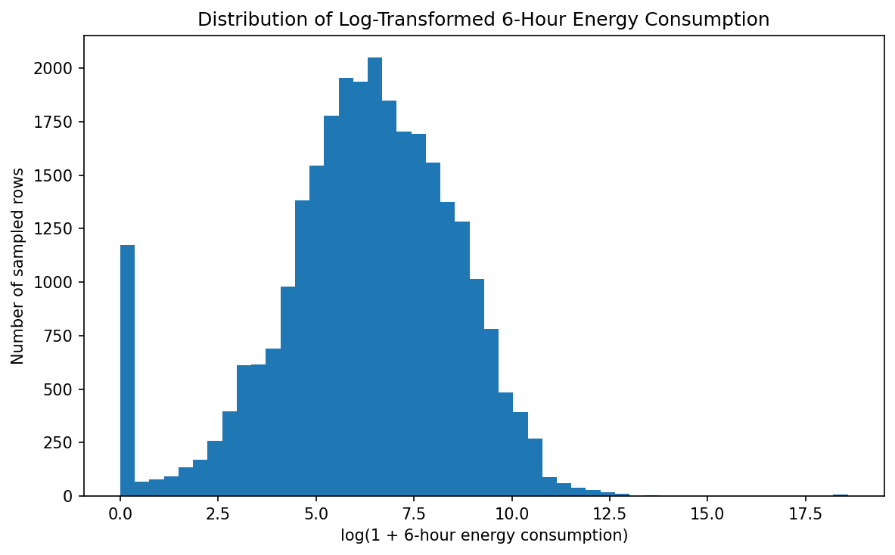

### Consumption by Primary Use

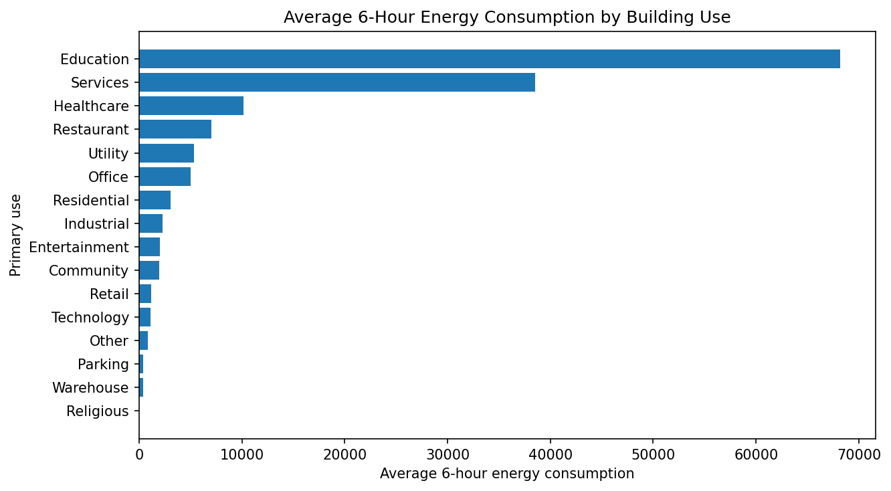

### Consumption by 6-Hour Block

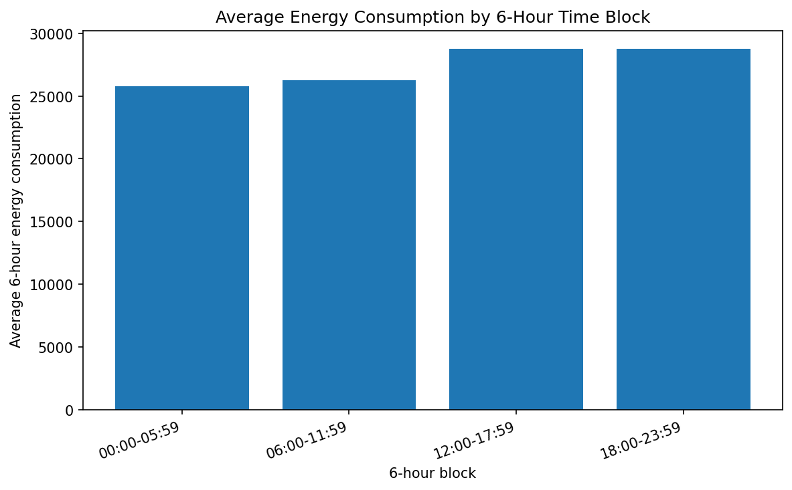

### Building Size vs Consumption

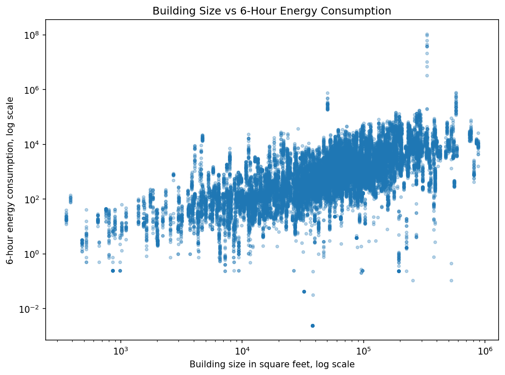

### Temperature vs Consumption

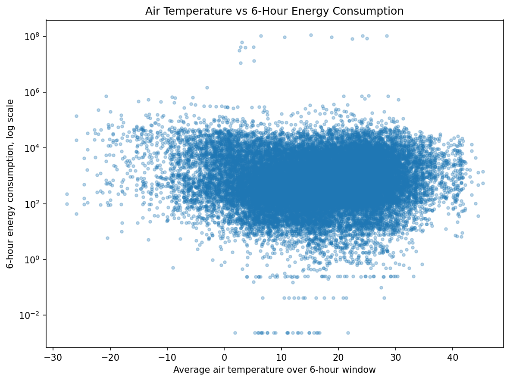

### Model Comparison

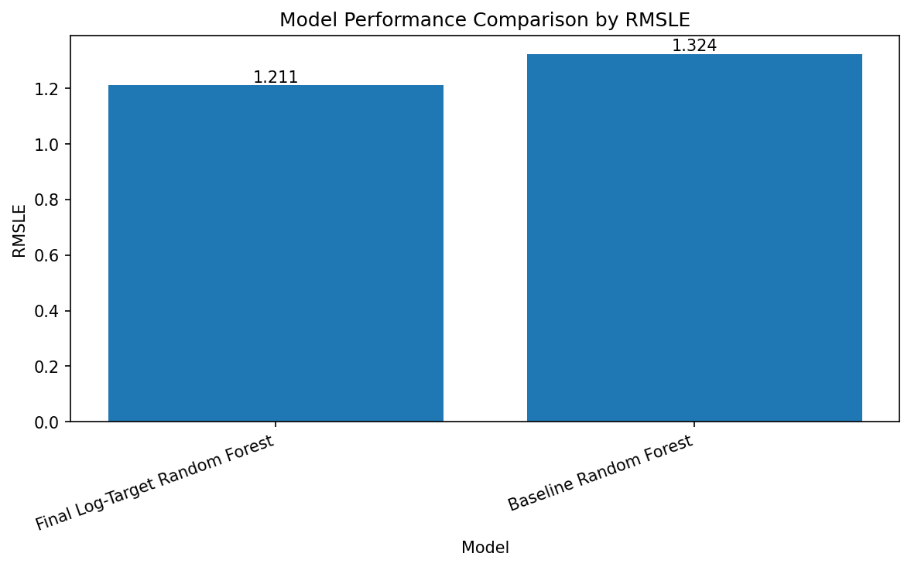

### Batch Actual vs Predicted

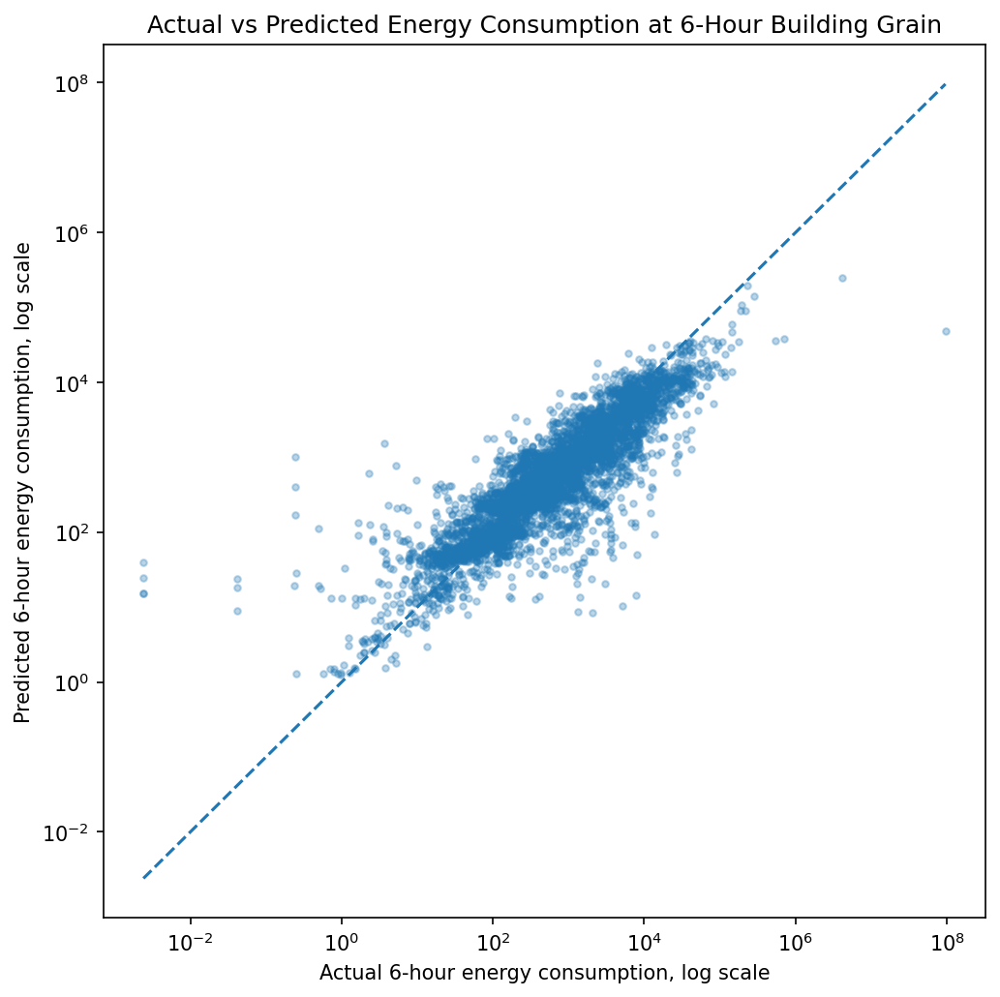

---

## Streaming Pipeline

The streaming pipeline contains three notebooks.

### 1. Kafka Weather Producer

Notebook:

```text
notebooks/streaming_producer.ipynb
```

This notebook reads weather records from CSV and sends them to Kafka.

Input topic:

```text
weather_stream
```

Producer outputs:

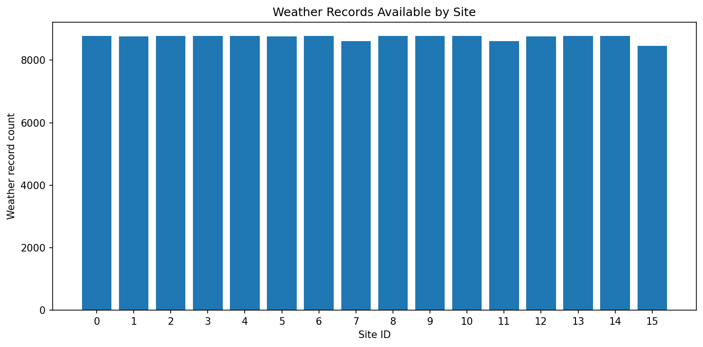

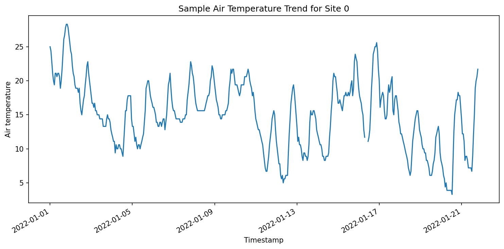

---

### 2. Spark Streaming Prediction

Notebook:

```text
notebooks/spark_streaming_prediction.ipynb
```

This notebook consumes weather records from Kafka, creates 6-hour weather features, joins building metadata and applies the saved Spark ML model.

Output topics:

```text
predictions_raw_v2
predictions_6h_v2
predictions_daily_v2
```

---

### 3. Streaming Consumer Visualisation

Notebook:

```text
notebooks/streaming_consumer_visualisation.ipynb
```

This notebook consumes prediction messages from Kafka and creates visual summaries of the streaming predictions.

Streaming outputs:

### Streaming Prediction Distribution

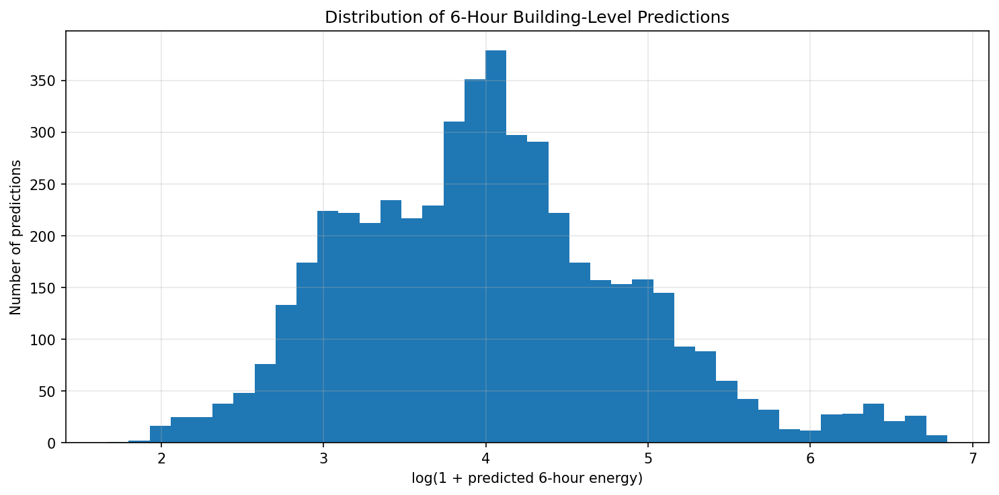

### Streaming 6-Hour Predictions

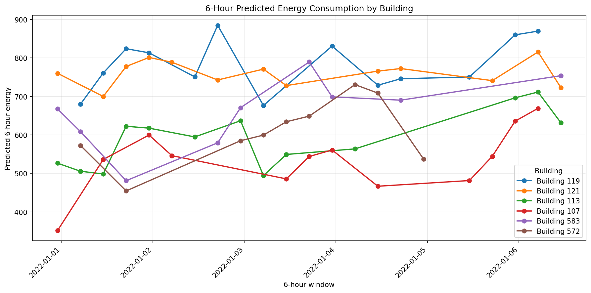

### Streaming Daily Predictions

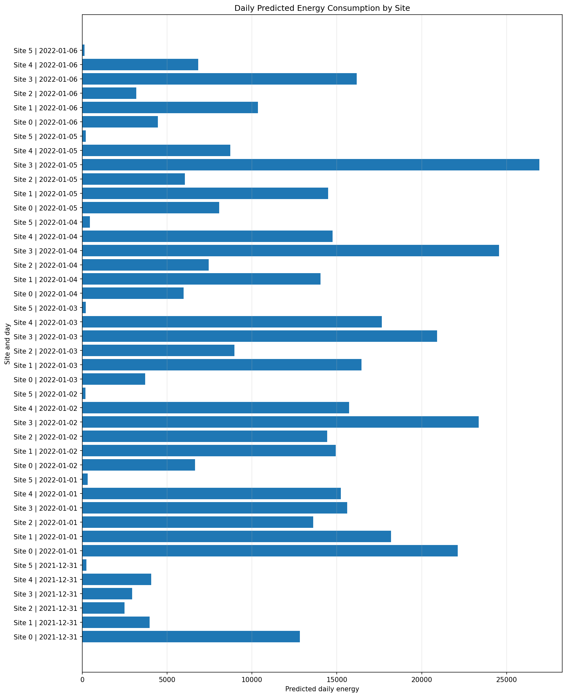

### Streaming Site Ranking

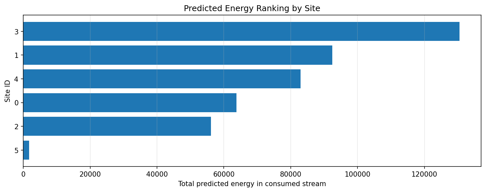

### Final Streaming Prediction Dashboard

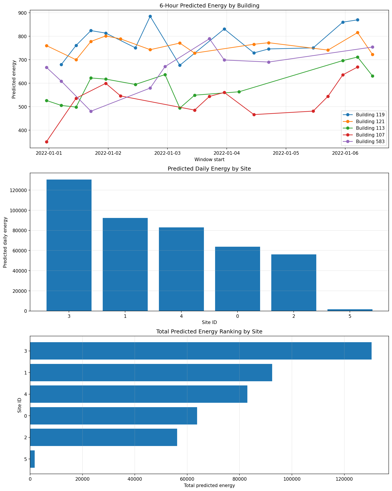

---

## How to Run the Project

### 1. Clone the Repository

```bash
git clone https://github.com/sai-harshith-data/building-energy-prediction-streaming.git
cd building-energy-prediction-streaming
```

---

### 2. Create Local Runtime Folders

```bash
mkdir -p data
mkdir -p models
mkdir -p checkpoints
mkdir -p outputs/Screenshots
```

---

### 3. Add Data Files

For full execution, place the original files inside:

```text
data/
├── building_information.csv
├── weather.csv
└── meters.csv
```

For lightweight testing, use the sample files:

```text
sample_data/sample_building_information.csv -> data/building_information.csv
sample_data/sample_weather.csv              -> data/weather.csv
sample_data/sample_meters.csv               -> data/meters.csv
```

---

### 4. Install Dependencies

```bash
pip install -r requirements.txt
```

Main packages:

```text
pyspark
pandas
numpy
matplotlib
kafka-python
```

---

### 5. Start Kafka with Docker

Start Zookeeper:

```bash
docker run -d \
  --name zookeeper \
  -p 2181:2181 \
  -e ZOOKEEPER_CLIENT_PORT=2181 \
  confluentinc/cp-zookeeper:7.5.0
```

Start Kafka:

```bash
docker run -d \
  --name kafka \
  -p 9092:9092 \
  -e KAFKA_BROKER_ID=1 \
  -e KAFKA_ZOOKEEPER_CONNECT=host.docker.internal:2181 \
  -e KAFKA_ADVERTISED_LISTENERS=PLAINTEXT://localhost:9092 \
  -e KAFKA_OFFSETS_TOPIC_REPLICATION_FACTOR=1 \
  confluentinc/cp-kafka:7.5.0
```

If running inside a Docker network, update the Kafka broker setting inside the notebooks.

---

### 6. Run Notebooks

Recommended full order:

```text
1. notebooks/building_energy_prediction.ipynb
2. notebooks/spark_streaming_prediction.ipynb
3. notebooks/streaming_producer.ipynb
4. notebooks/streaming_consumer_visualisation.ipynb
```

Recommended streaming order:

```text
1. Train and save the model using the batch notebook.
2. Start the Spark streaming prediction notebook.
3. Start the Kafka producer notebook.
4. Run the consumer visualisation notebook.
```

---

## Runtime Notes

The producer notebook uses a safety flag:

```python
RUN_PRODUCER = False
```

Change it to:

```python
RUN_PRODUCER = True
```

only when the Spark streaming prediction notebook is already active.

The Spark streaming prediction notebook uses a safety flag:

```python
START_STREAMING_JOB = False
```

Change it to:

```python
START_STREAMING_JOB = True
```

only after setup cells have run successfully.

---

## Why Streaming Actual-vs-Predicted Validation Is Not Included

The streaming consumer notebook focuses on prediction monitoring and visualisation.

Streaming actual-vs-predicted validation is not included because the streamed weather prediction sample and the actual meter dataset may not contain the same exact:

```text
building_id + site_id + 6-hour time window
```

A direct comparison without exact same-grain alignment can produce misleading results.

Model performance is reported from the batch test evaluation using RMSLE. The streaming notebooks demonstrate real-time prediction generation, Kafka message flow and prediction monitoring.

---

## Project Outcome

This project demonstrates the ability to:

```text
- Process large-scale time-series energy data with PySpark
- Clean and aggregate high-volume meter readings
- Engineer features from building, weather and time variables
- Train and evaluate a Spark ML regression model
- Save and reuse a machine learning model in a streaming environment
- Build a Kafka producer for simulated real-time data
- Apply Spark Structured Streaming for real-time prediction
- Publish and consume Kafka prediction topics
- Build portfolio-ready visualisations for streaming analytics
```

---

## Limitations

```text
- The uploaded GitHub sample data is small and intended for workflow review only.
- Full model performance requires the original complete dataset.
- The streaming setup is simulated using historical weather records sent through Kafka.
- The saved model folder is not uploaded because it is a generated artifact.
- Exact streaming actual-vs-predicted validation requires matching future meter readings at the same building and time-window grain.
```

---

## Future Improvements

```text
- Add automated model retraining
- Add MLflow experiment tracking
- Add Docker Compose for easier Kafka and Spark setup
- Add Streamlit or Power BI dashboard deployment
- Add anomaly detection for unusual building energy consumption
- Store prediction outputs in a database or data lake
- Deploy the streaming pipeline to a cloud environment
```

---

## Author

**Sai Harshith Reddy Moddu**

```text
Data Science
Big Data Analytics
Machine Learning
PySpark
Real-Time Streaming Analytics
```